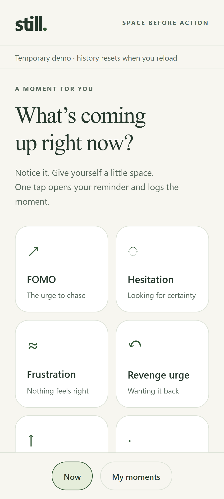
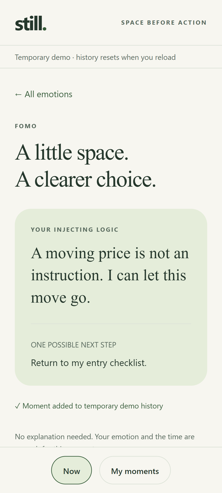

# still.

**A little space between an emotion and the next trade.**

An Android-first trading reflection app, built with React Native, Expo and TypeScript. Tap what you notice, read a personal reminder, capture your thoughts, and review them later. Built as a learning project with visible decisions, tests, and incremental delivery.

<p> </p>

Screenshots show the current React Native web demo with sample moments.

## Current increment

- Six starter emotion/urge cards, including **Unsure**.
- Immediate original injecting logic and an automatically timestamped moment.
- Recent-moment history, deletion, and system/light/dark appearance.
- Clear saving/failed/retry behavior, with bounded unsaved drafts.
- Native SQLCipher storage implementation with a SecureStore-protected random key; refuses plaintext fallback.
- A browser/Expo Go demo using bounded **temporary memory only**.

**Development milestone, not a production release.** Native encryption and lifecycle behavior still need verification on the Samsung S20. Voice capture, personal multimedia support cards, app unlock, backup/restore, session grouping and reflections are subsequent increments. Until the release checks are met, use sample moments only. Uninstalling the native app can lose its device-bound key; there is no restore flow yet.

## Try the demo

Use Node.js 24 or newer. From the repository root in Windows PowerShell:

```powershell
cd mobile
npm.cmd ci
npm.cmd run demo
```

Open a compatible Expo Go on Android and scan the QR code. The demo logs only to memory; reloading discards history. If a QR connection fails, check that the phone and computer share a network. Expo Go must support this project's SDK 57.

For a browser preview:

```powershell
npm.cmd run web
```

On macOS/Linux use `npm` and `npx` without `.cmd`. In PowerShell the `.cmd` form avoids the unsigned `.ps1` launcher error without changing execution policy.

## Native development build

Expo Go cannot provide SQLCipher. A native build is needed to exercise encrypted persistence. With Java and the Android SDK configured, and an emulator or authorized USB device connected:

```powershell
cd mobile
npx.cmd expo run:android --device
```

The checked-in `eas.json` also defines development, internal preview APK and production profiles. An Expo account/project must be configured before using cloud builds. No signing keys, Expo project ID or service credentials are committed. No cloud build or store release has been performed.

## Verify

Run inside `mobile/`:

```powershell
npm.cmd run typecheck
npm.cmd test
npm.cmd run export:android
npm.cmd run export:web
npx.cmd playwright install chromium
npx.cmd playwright test
```

Node's SQLite tests use real temporary databases; encryption bootstrap tests use controlled native dependencies and do **not** prove device encryption. Browser checks cover the rendered tap/support/history flow, deletion, themes and narrow screens. Android bundle export verifies compilation, not installation or native runtime behavior. GitHub Actions runs these checks on pushes and pull requests.

The lockfile includes a scoped `xcode → uuid` override to a patched CommonJS-compatible version. Review it when upgrading Expo and remove it once the upstream dependency is fixed. Never apply a breaking `npm audit fix --force` without examining the proposed changes.

## Learn with the project

Start with [Lesson 1: from a tap to a saved moment](docs/learning/01-first-moment.md). Each increment includes an explanation, a runnable result, an exercise and verification evidence.

| Location | Purpose |
|---|---|
| `mobile/App.tsx` | React Native screens and event wiring |
| `mobile/src/journal/` | Starter reminders and tap/save state transitions |
| `mobile/src/storage/` | SQLite repository, native encryption initialization and temporary demo |
| `mobile/tests/` | Behavior and real SQLite integration tests |
| `mobile/e2e/` | Browser interaction checks |
| `prototype/` | Earlier HTML concept, retained as design history |
| `docs/` | Decisions, reviews, learning notes and implementation plans |

## Roadmap to a live portfolio project

1. **First moment:** emotion → immediate support → timestamp → review.
2. **Voice capture:** Record/Stop/Play, permission denial, app-switch/lock stop-and-preserve, encrypted media.
3. **Personal support:** editable text, audio, image and combined injecting logic.
4. **Review and ownership:** sessions, reflections, tested encrypted backup/restore and deletion.
5. **Release:** app unlock, privacy checks, device memory measurements, signed internal Android trial, then public distribution.
6. **Portfolio:** screenshots, a walkthrough, architecture decisions, test evidence and release link.

Later possibilities: transcription, evidence-linked patterns, A/B/C protocol, iOS and web review. These are not current capabilities.

See [MVP scope](MVP-SCOPE.md), [security and memory requirements](SECURITY-AND-PERFORMANCE.md), and [first-increment plan](docs/superpowers/plans/2026-09-20-first-android-increment.md).

Conceptual influences include Mark Douglas's *The Disciplined Trader* and Jared Tendler's *The Mental Game of Trading*. Starter reminders are original copy, not quotations or endorsements. The app supports reflection; it does not predict trades or diagnose emotions.

## Privacy in this repository

Only source, synthetic examples and project documentation belong here. Real journals, recordings, backups, signing keys and credentials are excluded. The native app and browser demo do not include a journal-upload service.

The generated Expo template retains its upstream MIT notice in `mobile/LICENSE`. This repository does not currently declare a separate license for project-specific work.
