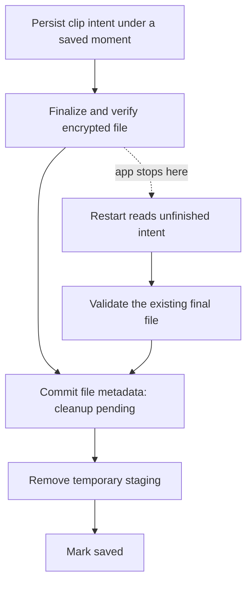

# Lesson 4: finishing a clip save after an interruption

A clip needs two things: its file and a database entry that says which moment owns it. SQLite can commit several database changes together. It cannot include an ordinary file write in that same transaction.

Imagine the phone stops the app just after encryption finishes. The encrypted file exists, but the database still says the save is unfinished. Deleting that file as abandoned cache would throw away a useful recording. Starting a new clip on retry would create duplicates.

The solution is to remember the operation **before** doing its file work. The same clip ID follows the operation through retries and restarts.



The operation has an original clip ID, moment ID and timestamp. A retry keeps all three. Several clips under one moment are separate rows, so adding another never overwrites the first.

## Stopped, committed and saved

These words describe different evidence:

| State | What we know | What remains |
| --- | --- | --- |
| Pending | The intent was saved | Validate and finish file work, then attach its metadata |
| Cleanup pending | Verified final file and its database reference exist | Remove temporary staging |
| Saved | Required file and metadata work completed | Nothing for this save |
| Deleting | A durable deletion request exists | Remove every owned file, then finish database cleanup |

A file or database error leaves the recovery record in place. It does not become success because the app caught the exception. Another recovery pass can try again; errors shown outside storage use fixed messages without raw SQL or native diagnostics.

## Deletion also needs memory

Deleting the database row first loses the information needed to find and remove its files. Instead, remember the deletion request, remove the files, and only then remove the row. A small tombstone retains the deleted ID so an old callback cannot recreate it.

Deleting a moment applies that process to all its clips, including unfinished ones. The owner stays marked for deletion until cleanup finishes. The repository processes work in pages so a long history does not require loading all attachments into memory.

## Laptop exercise

This increment is exercised with disposable synthetic files and real SQLite on the laptop. The fixture file adapter deliberately does **not** encrypt: it tests ordering, persistence and recovery. The separate native Tink proof in [Lesson 3](03-encrypted-files.md) is the current encryption evidence.

From the project folder:

```powershell
Set-Location mobile
node --experimental-strip-types --test tests/clipRecovery.test.ts
```

Find the case for an interruption after the final file is written but before metadata commit. Before reading its assertions, predict the result of reopening the database and running recovery:

1. How many clips should exist? **One**, with the original ID, owner and timestamp.
2. Which files should remain after recovery? **The final file**, with staging removed.
3. What should another recovery pass do? **No additional work** for that completed clip.

Also find the deletion-retry case. Its recovery record must survive a failed file removal; retry must finish removal rather than restore the attachment.

## What reaches the phone later

This repository is opt-in. The installed app still uses its existing journal opener; no phone database is migrated by this lesson. The next integration must supply a real native file adapter, enforce one database owner, reconcile unfinished work before capture is enabled, and route moment deletion through this repository. Its file adapter must honor the validated-file contract; a TypeScript interface cannot prove encryption or filesystem durability.

After that integration passes S20 migration and interruption checks, Record / Stop / Play can build on it. Several four-minute clips per moment remains the approved recording design. Native duration/size validation, space accounting, microphone permissions, lifecycle behavior and the existing release gates still need their own evidence.
