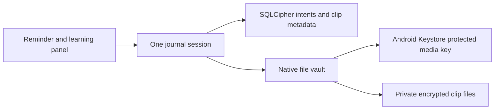

# Lesson 5: recovering real encrypted files on the phone

Lesson 4 tested the database decisions with disposable host files. This increment connects those decisions to the Android file vault. The files contain generated silence, not microphone recordings.

The boundary is small: JavaScript asks the vault to seal a clip, verify its final file, remove its staging file, or delete its owned files. It passes IDs and timestamps. The vault keeps paths, audio bytes and keys native.

One session owns both ordinary journal changes and the learning exercise. Otherwise a history deletion could run halfway through fixture creation and leave a newly created file without a database owner.

## Phone exercise

Use the updated development APK with Metro, as in Lesson 2. On Now, scroll to **Learning: clip recovery**.

1. Tap **Prepare recovery test**. It creates a synthetic moment and two short generated WAV clips. The first completes normally. The second stops after its encrypted file is ready but before its database metadata commits.
2. Predict what should happen next: another clip should not be created, and the existing encrypted file should not be thrown away.
3. Fully stop and relaunch the app process. Codex can do this over USB. Changing pages or refreshing only JavaScript is not the same check.
4. Tap **Check recovery**. The intended result is two saved clips, verified existing final files, and no temporary staging or verification files left.
5. Tap **Delete test moment**. This removes only the generated exercise moment and its associated files through coordinated deletion.
6. Fully stop/relaunch again and tap **Check recovery**. The deletion should remain complete. A small persisted exercise marker lets the check distinguish a completed deletion from a test that never ran.

The panel does not prepare or delete anything automatically. Startup recovery can finish operations that were already requested. A new explicit test run after deletion gets new IDs because deleted IDs are kept as tombstones.

## What is being demonstrated

The second clip makes the failure point visible. Its file is ready, but its saved status is not. The durable intent is what lets startup finish the correct operation after the original JavaScript state is gone.

The file vault must authenticate an existing final before using it. A damaged final is a failure even if a staging file is still present. Temporary verification plaintext is removed after checking; ciphertext is never treated as valid merely because a filename exists.

The Android database keeps the same existing key and moment snapshots. Its migration adds clip structures. Native media uses its own directory and wrapping key, separate from the earlier proof fixture and journal key.

## Limits and next step

Read the dated integration review and PROJECT-STATUS for the results actually observed. Expected exercise outcomes above are instructions, not evidence by themselves.

Generated one-second WAV files do not test microphone permissions, AAC encoding, voice quality, four-minute stopping, playback, screen lock or call interruptions. Android metadata inspection is not a complete decoder test. Process restart evidence also does not prove power-loss durability or production readiness.

The next user-facing increment can add Record / Stop / Play with the approved several-clips-per-moment model. Capture must still stop and preserve on leaving the foreground, never automatically restart, and report saving outcomes honestly.
