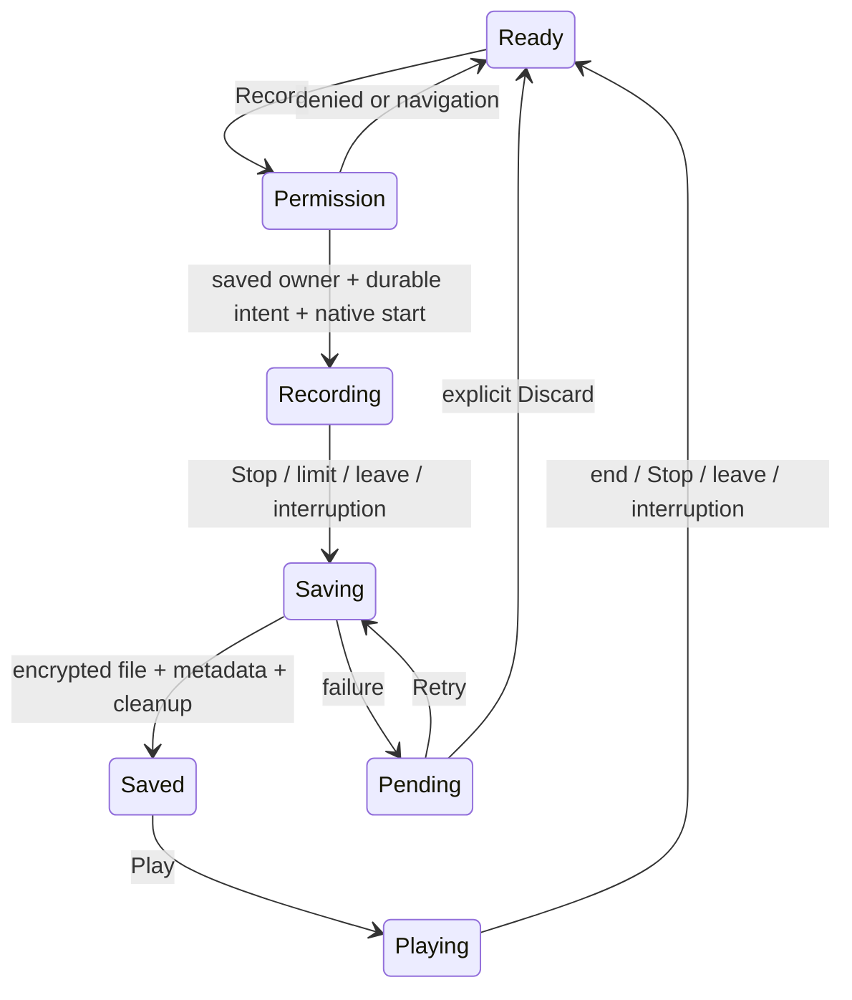

# Lesson 6: a recording has a lifecycle

A moment is a saved snapshot. A clip is an attachment with its own ID and recording time. Three Record presses create three clips attached to the same moment; they never replace one another.

## Why Stop is different from Saved

The microphone writes a temporary private AAC file. Stop asks the encoder to finalize its container and releases the microphone. The vault then checks the actual duration and size, encrypts and authenticates the file, and commits its database reference. Only after temporary plaintext cleanup completes is the clip **Saved**.

A failed save keeps its durable intent and any useful staging file. Retry uses the same clip ID, so it cannot append a duplicate. An immediate Stop or force-kill can leave an empty or unfinalized file. Retry cannot manufacture missing audio; Discard explicitly removes that failed capture.

The owner ID is captured when Record is pressed. If you move to another moment while an operation finishes, the clip still belongs to the original moment. One controller lives above the screens; one journal queue owns database/file compositions; native code owns microphone/player resources.

## What happens away from the screen

Android stops capture on background, screen lock or focus interruption and retains the staging file. JavaScript may be suspended then, so the native boundary must enforce stopping and the four-minute/size limits. On return, the controller requests encrypted saving; after a killed process, startup recovery tries the same durable intent. Recording never starts automatically on return.

Play authenticates the whole ciphertext into one temporary private playback file before the player opens it. Stop, completion, leaving or interruption releases the player and removes that temporary file. Startup cleanup handles abandoned playback files.

The installed Expo Audio SDK 57 code chooses random recording paths and pauses/resumes across background transitions. This increment uses its permission request API and a small owned Android recorder/player adapter for the stricter lifecycle. The [versioned Audio documentation](https://docs.expo.dev/versions/v57.0.0/sdk/audio/) and installed Android source determined that boundary.

## Try it with a sample moment

1. Predict whether leaving while Android asks for permission should start a recording. It should not start after navigation.
2. Save a sample FOMO moment. Press Record, allow the microphone, say “test clip one,” then Stop. Wait for **Saved**.
3. Record “test clip two.” Both clips should have their own time, duration and Play button. Listen to each.
4. Start a third clip, switch apps, and return. Predict the state before looking: stopped and saved, or visibly pending if saving failed; never automatically recording.
5. Leave one sample clip running to the four-minute limit. The microphone should stop; saving follows. Start another only with an explicit Record press.
6. Cold-restart the development app using Lesson 2. Open the saved moment from **My moments → Open voice clips**. Check playback, then delete only the sample clips you created.

Record what actually happened, including permission decisions, measured durations/bytes and unexpected states. Listening quality is a human observation; automated duration/metadata checks do not prove intelligibility. See the [dated review](../reviews/2026-09-22-record-stop-play.md) for the evidence collected, rather than treating this exercise as already passed.

For the September22 exercise, **Voice test Sep22** retains three clips: 0:47, 0:09 and 3:59. The last stopped automatically at 239.527 seconds and used 1,965,396 encoded bytes. All three survived the final cold restart, and Rikesh reported earlier playback clear enough. Try predicting what Play and then Stop will do to temporary storage before using those controls. Deliberate screen lock, permission denial and the other unrun checks remain listed in the review.

## September 23 follow-up

The [next device review](../reviews/2026-09-23-recording-device-checks.md) records Android-enforced denial, two immediate-Stop clips (488 ms and 534 ms), and a screen-lock clip (3576 ms) that stayed stopped after unlocking. All survived cold restart. These live under **Voice test Sep23**; earlier samples are retained separately. The UI floors durations to whole seconds, so the two short saved clips display **0:00**. Predict why that label does not mean the files are empty. Denying by tapping the Android dialog, calls/headphones, longer memory profiling and device fault tests remain open; bounded cleanup checks follow below.

## Measuring cleanup

The [resource-cycle review](../reviews/2026-09-23-recording-resource-cycles.md) separates three checks: temporary files disappear, operating-system handles do not keep accumulating, and memory stays within a measured range. They answer different questions. A recording can be saved and its files cleaned up while the runtime still retains memory.

During testing, even debugger evaluations of `1 + 1` increased measured native-heap memory. Before blaming recording, repeat the measurement without those debugger calls. **Exercise:** if deleting a test clip restores the exact original file set but memory stays higher, what has been verified, and what still needs investigation?

## PSS and allocated memory

The [longer baseline](../reviews/2026-09-23-recording-memory-baseline.md) completed sixteen cycles before a failed start interrupted the planned twenty. At three fixed idle checkpoints, allocated native memory stayed around 111–113 MiB even though total PSS was higher than at startup. These counters measure different aspects of the whole app; they do not directly measure how much audio is stored.

Exercise: compare cycles seven/eight in that review. Allocated native memory fell by 15654 KiB, while PSS fell by 6731 KiB. Why is that useful evidence of memory release but insufficient to certify indefinite stability? Keep the separate start failure in view: good memory readings do not prove every recording transition succeeds.

## Pending work without audio

The September23 failed-start follow-up demonstrated a pending intent with no remaining audio file. Retry kept it pending; confirmed Discard cleared it and enabled Record. **Exercise:** why can a pending operation exist without a playable clip, and why should Retry preserve it instead of silently treating it as Saved? Trace `journalSession.ts`: the durable intent is created before native capture is requested. This ordering makes interrupted work discoverable, while the original start-failure cause still needs separate evidence.

## Cancelling an old Record request

The [permission-start review](../reviews/2026-09-23-permission-start-cancellation.md) documents a reproduced race: Record was waiting for permission, the user left, and capture started only after returning. A foreground check alone allowed it because the app was foreground again by then. The fix invalidates the earlier request when leaving; a fresh Record press gets a new request. The permission adapter checks an existing grant first to avoid an unnecessary Android permission request.

If granting permission backgrounds the app, granting access now leaves it stopped. Press Record again to capture. **Exercise:** predict what should happen when permission resolves (a) while still away and (b) after returning. Both must leave the old request cancelled.

The later actual-Deny check blocked capture but showed no explanation. The cancellation guard returned before publishing the denial message. That feedback gap remains open. **Exercise:** name the two separate assertions here: what must never happen, and what the user should be told. A test can pass one and fail the other.

## Storage intuition

At 64000 bits/second, four minutes is approximately `64000 × 240 ÷ 8 = 1,920,000 bytes` before container/encryption overhead. Mono AAC avoids the much larger uncompressed PCM files. The recorder stops at 239.5 seconds to leave a small AAC finalization margin within the strict 240-second saved-file bound. The native file ceiling is 4 MiB, and admission keeps 100 MiB plus working allowance free on the phone. Audio storage includes saved and temporary files; a 250 MiB warning asks you to review, never automatically deletes originals.

The laptop reuses one dependency tree, the S: alias, existing Android tools and build caches. A native change needs an incremental ARM64 rebuild. JavaScript-only UI changes use Metro.

These are development controls. App unlock, encrypted backup/restore, missing-key recovery and release validation remain separate gates.
